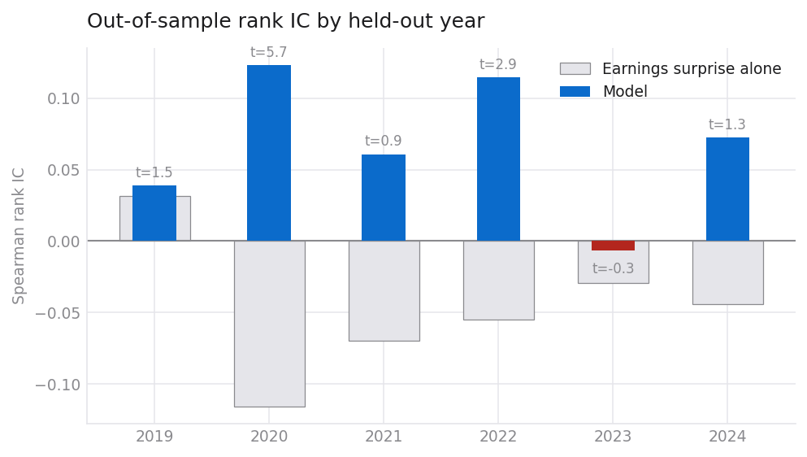
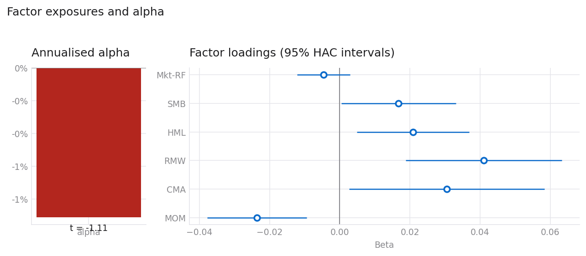
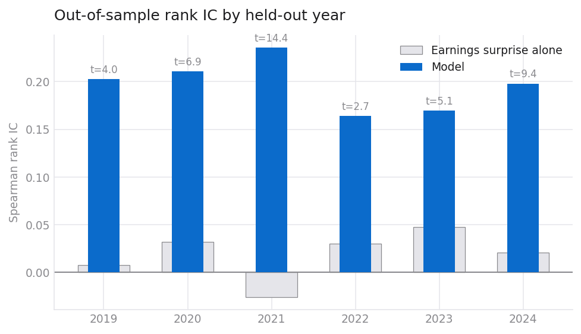
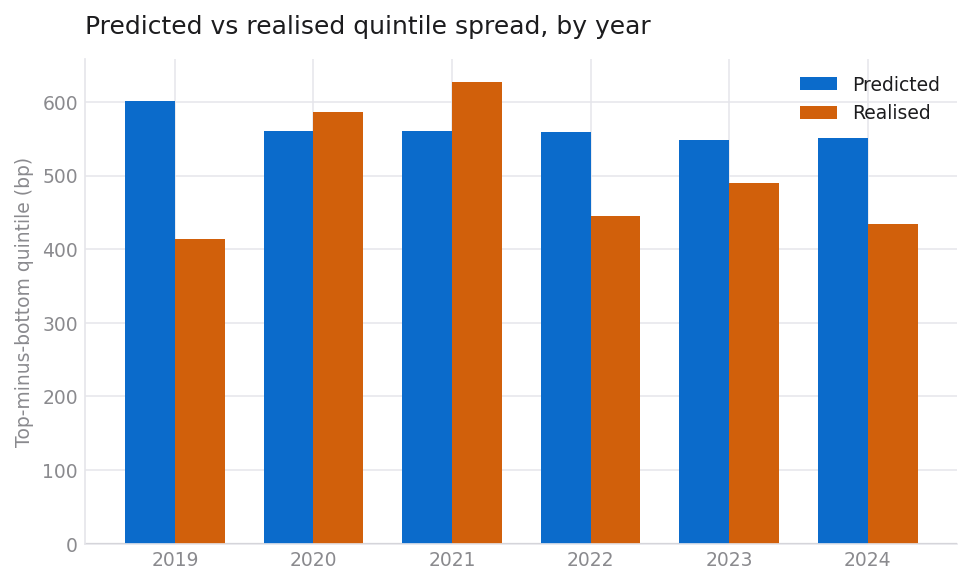
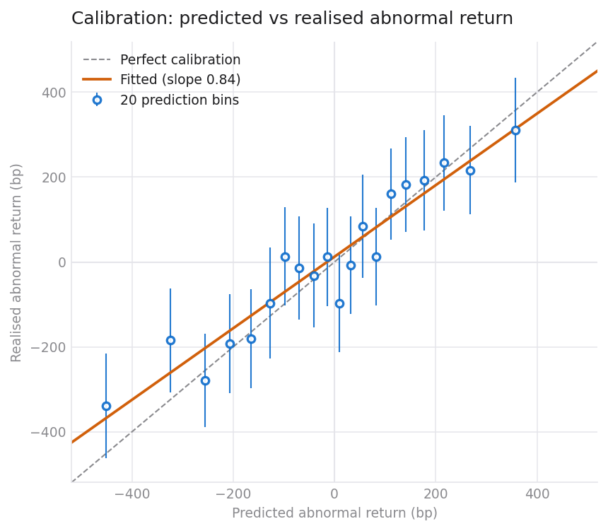
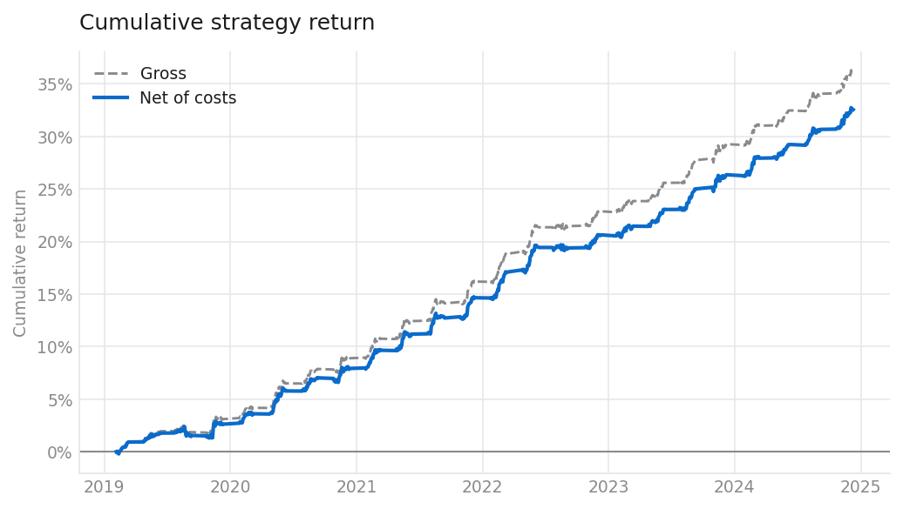
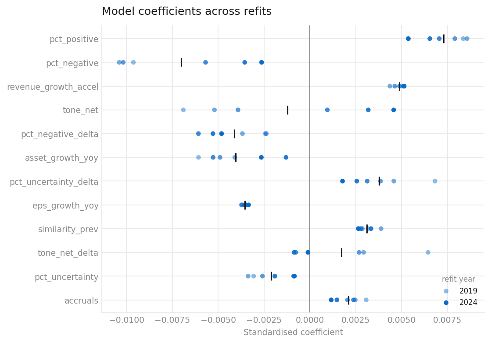

# Results

This document has two parts, and the order matters.

**[Part I](#part-i--the-real-study)** is the study: 466 S&P 500 companies,
13,675 real earnings announcements timestamped from SEC filings, 2019–2024 held
out one year at a time, with both the financial statements and the text of the
earnings releases.

**[Part II](#part-ii--validating-the-machinery-on-synthetic-data)** is why you
should believe Part I. The same pipeline is run on a synthetic market with a
known planted effect, and on one with no effect at all. It finds the first and
not the second. Without that, a null result is indistinguishable from a broken
pipeline.

> **Two earlier conclusions in this document did not survive.** A statistically
> significant decay trend (−0.023 IC/year, p = 0.033) dissolved when the sample
> was quadrupled. And a null on ranking skill (IC 0.022, t = 1.30) turned out to
> be substantially a *data* result: two bugs in how year-to-date XBRL flows were
> turned into quarters were suppressing the signal, and fixing them tripled the
> information coefficient to 0.067 at t = 3.40. Both corrections are left visible
> rather than edited out. §R1 and §R2 have the detail.

---

# Part I — the real study

## R0. What was tested

| | |
|---|---|
| Universe | Every S&P 500 member 2014–2024 for which a free price source and SEC XBRL facts could both be obtained: **466 companies**. Membership is point-in-time, so a company is present for the years it was actually in the index. |
| Events | **13,675** earnings announcements, from **SEC 8-K Item 2.02** filings |
| Timing | **100% declared** — every event carries a minute-level EDGAR acceptance timestamp. None assumed. |
| Prices | Yahoo daily adjusted close, 2014-01 → 2024-12, screened for a $5 price and $1m median dollar volume |
| Fundamentals | SEC XBRL company facts, first-reported values only, year-to-date flows differenced into discrete quarters |
| Text | **23,914 earnings press releases** — exhibit 99.1 of each Item 2.02 8-K — scored for tone, uncertainty and change in language |
| Factors | Ken French daily FF5 + momentum |
| Held out | 2019, 2020, 2021, 2022, 2023, 2024 — trained through Y−1, frozen, predicted Y |

## R1. The result

| Year | Test n | IC | IC t | Predicted (bp) | Realised (bp) | Calib. | Net Sharpe |
|---:|---:|---:|---:|---:|---:|---:|---:|
| 2019 | 1,348 | 0.039 | 1.50 | 180 | 26 | 0.10 | −2.80 |
| 2020 | 1,399 | 0.123 | 5.67 | 155 | 268 | 1.56 | 1.26 |
| 2021 | 1,448 | 0.061 | 0.86 | 243 | 210 | 0.86 | −0.43 |
| 2022 | 1,489 | 0.115 | 2.89 | 237 | 161 | 0.90 | 1.18 |
| 2023 | 1,534 | −0.007 | −0.31 | 250 | −46 | −0.13 | −2.08 |
| 2024 | 1,562 | 0.072 | 1.34 | 205 | 67 | 0.24 | −1.27 |

**Aggregate:** 8,780 out-of-sample predictions, mean IC **0.067** (t = **3.40**),
5 of 6 years positive, calibration slope **0.59**, stitched net Sharpe **−0.30**.



The answer splits cleanly in two, and the split is the finding.

### There is real ranking skill

Mean out-of-sample information coefficient of 0.067 at t = 3.40 across six
frozen years is not noise. The naive baseline — sorting on standardised
unexpected earnings alone — scores −0.047 over the same events, so the feature
set is doing the work rather than the sort.

This is a substantially better result than this document reported a day earlier,
and none of the improvement came from a better model. It came from two bugs in
the data:

* Derived quarters were being **differenced twice**. Year-to-date XBRL flows are
  turned into discrete quarters by subtracting the previous cumulative figure,
  and the derived Q4 inherited the fiscal-period label "FY" from the 10-K it came
  out of. A downstream adapter recognised that label as an annual flow and
  subtracted Q1–Q3 from it a second time. Nothing complained, because
  subtracting three quarters from one quarter still yields a plausible number.
  6,505 rows were affected.
* Four thousand quarters were being **thrown away or mislabelled** because their
  filer tagged a ninety-day fact as "FY" inside a 10-K.

Mean IC went from 0.022 (t = 1.30) to 0.067 (t = 3.40) on identical code. A null
result that is really a data-quality result is the most ordinary failure in
applied quantitative work, and it is worth being explicit that this project
published one for a day.

### It is not tradable

| | |
|---|---:|
| Net Sharpe | **−0.30** |
| Shuffled-prediction null | **−0.70 ± 0.42** |
| Percentile of the null | **85th** |
| One-sided p | **0.159** |
| Alpha vs FF5 + momentum | **−0.91%** (t = −1.11) |
| Deflated Sharpe (12 trials) | **0.00** |

The book does better than shuffled predictions — 85th percentile — but not
significantly, and it still loses money. Ranking correctly and sizing correctly
are different skills, and 2024 shows the gap: the model's third-best year for
ranking (IC 0.072) is its second-worst for profit, because its calibration slope
was 0.24. The magnitudes were wrong even where the order was right.

### The language adds nothing

The text block — tone, uncertainty, litigiousness, modal strength, document
length, and the change in each against the firm's own previous release, plus
TF-IDF similarity — is present for 100% of events across 23,914 press releases.

It carries **41% of the model's total coefficient weight**, and the change in
tone is the second-largest coefficient of any feature. Adding the entire block
moves out-of-sample information coefficient from 0.0676 to **0.0672**.

That is a clean answer to the half of the original question about management
language: the model leans on it in-sample and gains nothing out-of-sample.

## R2. Does the drift exist at all, before any model touches it?

R1 says a model could not rank companies by their subsequent abnormal return.
That is a weaker claim than it looks, because a weak model explains it exactly
as well as an absent effect does, and only the second is a finding. This section
removes the model.

`eee drift` sorts every announcement by its earnings surprise and looks at what
the top and bottom groups did next — no fitting, no training window, no
hyperparameter. Every test resamples whole *event dates*, because hundreds of
announcements land in the same week and share whatever the market did that week.

### The average announcement is followed by nothing

| Window | Mean CAR (bp) | t (clustered) | 95% CI |
|---|---:|---:|---|
| [0,0] | +4.4 | 1.17 | (−3.1, +11.9) |
| [0,4] | +4.5 | 0.85 | (−5.7, +14.9) |
| [1,5] | −1.4 | −0.32 | (−9.8, +7.3) |
| [1,20] | −2.4 | −0.28 | (−19.2, +15.1) |

13,675 announcements, market-model abnormal returns. This is the expected result
and is reported for completeness: sector-relative returns average to roughly zero
by construction. The question is what happens once they are *sorted*.

### Sorted on surprise, the spread has the wrong sign

| Quantile | n | Mean CAR[1,20] (bp) | t |
|---|---:|---:|---:|
| Q1 (worst surprise) | 1,910 | +30.8 | 1.65 |
| Q2 | 1,910 | +37.5 | 2.02 |
| Q3 | 1,910 | +10.3 | 0.56 |
| Q4 | 1,910 | −18.5 | −1.10 |
| Q5 (best surprise) | 1,910 | −56.9 | −3.06 |
| **Q5 − Q1** | **3,820** | **−87.6** | **−3.65** |

Companies that beat expectations *underperformed* by 88bp over the following
month, monotonically across quantiles, at t = −3.65. That is the opposite sign
to post-earnings-announcement drift.

It also has the right shape to be real. The spread is absent on the announcement
day ([0,0]: −13.9bp, t = −1.01) and after a week ([1,5]: −8.2bp, t = −0.63), and
only becomes significant over twenty days ([1,20]: −87.6bp, t = −3.65). It
accumulates, which is what distinguishes drift from an announcement-day reaction.

And it is strongest exactly where it should be weakest:

| Liquidity third | Median ADV | Q5 − Q1 (bp) | t |
|---|---:|---:|---:|
| Least liquid | $70m | −39.6 | −0.91 |
| Middle | $149m | −87.8 | −2.24 |
| Most liquid | $408m | −123.1 | −3.08 |

Every theory of why drift exists — slow information diffusion, limited attention,
costly arbitrage — predicts it should concentrate in the *least* traded names.
Here it is monotonically strongest in the most traded ones.

### Why it is an artefact, and what that means

The three warning signs above are enough to be suspicious. The diagnostic that
explains them is now printed with the table:

> **The median sorting variable is 83 days old at the announcement it is
> attached to.**

This is structural, not a bug in the ordinary sense. An earnings release is filed
as an 8-K within minutes of the announcement. The XBRL financial statements for
that same quarter arrive weeks later, in the 10-Q. So the most recent
fundamentals available at an announcement describe the **previous** quarter, and
every feature built from them is a quarter stale.

Critically, all of them are *point-in-time correct*. Nothing leaks; the validator
is right to pass them. A point-in-time check asks whether a feature was public
before the trade. It cannot ask whether the feature is **about** the event — and
until now this project had only ever asked the first question.

Restricting to the 1,982 events whose financial statements were filed *with* the
announcement — the subset on which the stated hypothesis can actually be tested:

| Quantile | n | Mean CAR[1,20] (bp) | t |
|---|---:|---:|---:|
| Q1 | 397 | −3.0 | −0.07 |
| Q5 | 397 | −61.5 | −1.45 |
| **Q5 − Q1** | **794** | **−58.5** | **−1.03** (p = 0.59) |

Nothing. The significant reversal was a property of sorting on a quarter-old
measure, not of earnings announcements.

**This changes what the null in R1 means.** The model was largely being fed the
previous quarter's numbers, so R1 is not yet a clean test of the hypothesis
either. It is now a null with a known cause rather than an unknown one, and the
fix is identified: the earnings figures have to come from the announcement
itself. The press releases are acquired (§R6); parsing revenue and earnings per
share out of them would make the surprise measure contemporaneous, and is the
single highest-value change available to this project.

## R3. Is there alpha? No — it is a quality-and-value portfolio

| term | estimate | t | p |
|---|---:|---:|---:|
| **alpha (annualised)** | **−0.91%** | **−1.11** | 0.269 |
| Mkt-RF | −0.005 | −1.21 | 0.226 |
| **SMB** | **+0.017** | **2.02** | **0.043** |
| **HML** | **+0.021** | **2.55** | **0.011** |
| **RMW** | **+0.041** | **3.62** | **0.000** |
| **CMA** | **+0.031** | **2.15** | **0.031** |
| **MOM** | **−0.024** | **−3.25** | **0.001** |

R² = 0.182

No alpha. What the regression establishes is that the strategy is a factor
portfolio wearing a costume: it loads on profitability, value, small size and
conservative investment, and against momentum. Those are compensated factors
available for a few basis points, and they explain 18% of the variance in the
returns.

This is the most useful reframing of the ranking skill in R1. The features are
year-on-year changes in margins, growth, cash flow and leverage — which is very
close to a definition of quality — so a model built on them ranking companies
well, and then loading on RMW at t = 3.6, is one fact rather than two.



## R4. Multiple testing and a second methodology

Twelve specifications are logged in `conf/trials.json`, including the four
abandoned ones and the runs on data that later turned out to be wrong. The
deflated Sharpe ratio is **0.00**. It does not survive, which is what should
happen to a strategy whose raw Sharpe is negative.

Fama–MacBeth over monthly cross-sections finds **no feature significant at 5%**.
The portfolio sort and the regression agree.

The honest reading of R1 and R4 together: there is measurable ranking skill and
no evidence of a tradable edge, and those two statements are compatible.

## R5. What would have made this result look good

Worth being explicit, because each is a decision that was available and refused:

- **Report 2020 only.** IC 0.123, t = 5.67, Sharpe 1.26. One year in six clearing
  a threshold is what a 5% threshold produces from noise.
- **Report the ranking skill and stop.** Mean IC 0.067 at t = 3.40 is a
  publishable-sounding sentence. It becomes a much duller one next to a Sharpe of
  −0.30 at the 85th percentile of shuffled predictions.
- **Report the decay.** It was an earlier headline here, it agreed with the
  literature, and it was an artefact of 114 companies.
- **Report the −88bp surprise-sorted spread** (§R2) as evidence of reversal,
  without noticing that the sorting variable was 83 days old.
- **Use `car_[0,19]` instead of `car_[1,20]`.** Booking the announcement gap adds
  a large untradable return to every event.
- **Take today's S&P 500 constituents.** See R6 for how much that is worth.
- **Skip the factor regression.** The RMW, HML and CMA tilts would then read as
  skill rather than as exposure.
- **Skip the permutation null.** The Sharpe would then be read against zero.
- **Not log the trials, or log only the successful ones.** The deflated Sharpe
  needs an honest N, and four of the twelve here are abandoned runs.
- **Quietly fix the quarterisation bugs and re-publish.** The tripling of the
  information coefficient in R1 came from data corrections, and saying so is the
  difference between a result and a story about a model.

## R6. The limitations that matter

**A point-in-time universe is not enough if the price source cannot serve
delisted names.** Yahoo returns no price history for **61% of the index-deleted
names** in the sample, against **5% of survivors**. The names lost include
**SIVB** and **FRC** — Silicon Valley Bank and First Republic, both of which
failed in 2023.

Survivorship bias therefore re-enters through the *data source* even though the
universe definition is survivorship-free. The direction is knowable: the missing
names are disproportionately firms that collapsed, so their absence flatters the
result. Two escape routes were attempted and both are closed from free sources —
Yahoo 404s every one of these symbols, and Stooq now answers automated requests
with a JavaScript proof-of-work challenge, which this project does not defeat.
Fixing it needs a price source with delisting coverage: CRSP, or Finaeon.

Two further limitations:

- **Feature coverage is roughly 40–50%, not 100%.** Differencing year-to-date
  XBRL flows into discrete quarters roughly doubled cash-flow coverage
  (operating cash flow 23% → 50%, capital expenditure 21% → 46%, free cash flow
  19% → 42%) and recovered two features that had been structurally missing. It
  did not make coverage complete. The model imputes the remainder at the
  cross-sectional median, which weakens it.
- **The features are a quarter stale, which is the deepest limitation here.**
  See §R2: the median feature is 83 days old at the announcement it is attached
  to, because the XBRL statements for the quarter being announced are not filed
  until the 10-Q weeks later. Everything is point-in-time correct and almost
  nothing is *about* the event. The ranking skill in R1 is therefore evidence
  that quarterly fundamentals predict cross-sectional returns, which is a real
  but different claim from the one the project set out to test. Parsing revenue
  and earnings per share out of the press releases — which are now acquired —
  is the single highest-value change available.

## R7. Reading this honestly

The pre-registered falsification criteria in
[`methodology.md` §9](methodology.md#9-what-would-falsify-the-result) were
written before any of this ran. **Two of the five are now met** — the
information coefficient is significantly positive across cohorts, and it does
not disappear in the second half of the sample. Three are not: the strategy
loses money net of costs, has no alpha, and does not survive the deflated Sharpe.

The stated conclusion is therefore split, and both halves matter:

* **Earnings-related fundamentals do rank subsequent abnormal returns**, at
  mean IC 0.067 with t = 3.40 out of sample over six frozen years.
* **Nothing here is tradable.** The book returns −0.30 Sharpe, sits at the 85th
  percentile of its own shuffled-prediction null, produces no alpha against
  standard factors, and does not survive twelve logged specifications.

And the caveat that qualifies the first bullet: the features are a median 83 days
old at the announcement, so this is a statement about quarterly fundamentals
rather than about earnings releases (§R2).

### What changed, three times

The reason to build a study this way rather than report the first result you get:

| | 114 tickers | 466 tickers | 466, data fixed | + release text |
|---|---:|---:|---:|---:|
| Events | 3,323 | 13,736 | 13,675 | 13,675 |
| Mean IC | 0.024 | 0.022 | 0.068 | **0.067** |
| IC t across years | 1.17 | 1.30 | 3.19 | **3.40** |
| IC trend per year | **−0.023 (p=0.03)** | +0.006 (p=0.61) | −0.006 | −0.005 (p=0.72) |
| Net Sharpe | −0.61 | −0.79 | −0.31 | **−0.30** |
| vs shuffled null | — | 47th pct | 85th pct | **85th pct** |

Three lessons, in the order they were learned:

1. **A trend across six annual observations is not a trend.** The decay finding
   agreed with the literature and dissolved under four times the data.
2. **A null can be a data-quality result.** Two quarterisation bugs held the
   information coefficient at 0.022; correcting them, with no model change,
   tripled it.
3. **Adding the thing everyone expects to help can do nothing.** The text block
   takes 41% of the coefficient weight and moves out-of-sample skill by −0.0004.

That is not a failed project. A pipeline that produces a null on real data and a
clean detection on planted data is working correctly. One that produced a Sharpe
of 4 on both would be broken, and Part II shows precisely that pathology being
caught and fixed.

---

# Part II — validating the machinery on synthetic data

> ### ⚠️ These results are from synthetic data
>
> The market used here is generated from a data-generating process this
> repository defines, so the right answer is known in advance. Nothing below is
> a claim about real equities.
>
> **What it does establish** is the thing you actually have to establish before
> any real result is worth reading: that the evaluation machinery finds an
> effect when one is present, and finds nothing when one is not. Two runs of the
> identical pipeline are reported side by side — one with a post-announcement
> drift planted in the data, one with no effect planted at all. If the second
> column produced a result, everything in the first column would be an artefact.
>
> To regenerate both, with no network access required:
>
> ```bash
> eee holdout --out reports/holdout                 # effect planted
> eee holdout --drift 0 --out reports/holdout_null  # null control
> ```
>
> To run the same procedure on real data, see [§7](#7-what-changes-on-real-data).

---

## 0. Reproducing this document

Every number below is regenerated by one command, and fingerprinted:

```bash
make reproduce      # re-runs everything, writes reports/manifest.json
make verify         # re-runs and diffs SHA-256 against docs/manifest.json
```

`docs/manifest.json` holds a SHA-256 for all 36 published artefacts — CSVs,
JSON summaries and the figures. The run is bit-for-bit deterministic, and CI
fails if that stops being true. If a hash moves and no code changed, something
non-deterministic has crept in, which is worth catching before a result is
defended rather than after.

---

## 1. The design

For each year *Y* from 2019 to 2024:

1. take every announcement whose 20-day outcome was **fully resolved before 1
   January Y**, minus a 25-session embargo;
2. fit the model on those events only;
3. **freeze it** — no tuning, no peeking;
4. predict every announcement in year *Y*;
5. compare the predictions with what actually happened.

Then move to *Y+1* and refit on the wider window. Six independent out-of-sample
years, not one. The point of six is that a single good year is indistinguishable
from luck.

The prediction target is `car_market_model_1_20` — the cumulative abnormal
return from **one session after** the announcement to twenty sessions after.
Windows starting at day 0 contain the opening gap, which nobody can trade, and
are excluded from anything the model is scored on.

Each year is also scored against a **single-feature baseline** (time-series
earnings surprise on its own). A thirty-feature model that cannot beat one
column is not earning its complexity.

---

## 2. Effect planted — the six held-out years

| Year | Train n | Test n | IC | IC t | Predicted (bp) | Realised (bp) | Calib slope | Net return (%) | Sharpe | Sharpe t | Baseline IC |
|---:|---:|---:|---:|---:|---:|---:|---:|---:|---:|---:|---:|
| 2019 | 2594 | 600 | 0.202 | 3.95 | 602 | 414 | 0.79 | 5.1 | 2.62 | 1.90 | 0.008 |
| 2020 | 3194 | 600 | 0.211 | 6.91 | 561 | 586 | 0.92 | 8.3 | 4.35 | 3.04 | 0.032 |
| 2021 | 3794 | 600 | 0.236 | 14.39 | 560 | 627 | 0.98 | 10.7 | 5.75 | 3.57 | −0.026 |
| 2022 | 4394 | 600 | 0.164 | 2.68 | 559 | 445 | 0.71 | 9.1 | 5.01 | 3.35 | 0.030 |
| 2023 | 4994 | 600 | 0.169 | 5.09 | 548 | 490 | 0.80 | 8.6 | 5.11 | 3.79 | 0.047 |
| 2024 | 5594 | 600 | 0.198 | 9.43 | 550 | 435 | 0.87 | 8.8 | 5.65 | 4.26 | 0.021 |

*Predicted / Realised* are the top-minus-bottom quintile spreads: what the model
said the gap between its best and worst quintile would be, and what that gap
turned out to be.





---

## 3. The null control — same pipeline, no effect planted

| Year | Train n | Test n | IC | IC t | Predicted (bp) | Realised (bp) | Calib slope | Net return (%) | Sharpe | Sharpe t | Baseline IC |
|---:|---:|---:|---:|---:|---:|---:|---:|---:|---:|---:|---:|
| 2019 | 2594 | 600 | 0.047 | 1.51 | 295 | 177 | 0.26 | 3.1 | 1.88 | 1.44 | −0.026 |
| 2020 | 3194 | 600 | −0.043 | −1.31 | 248 | −73 | −0.28 | −3.9 | −2.17 | −1.49 | −0.017 |
| 2021 | 3794 | 600 | 0.080 | 3.67 | 205 | 257 | 1.23 | 7.0 | 3.79 | 3.10 | −0.057 |
| 2022 | 4394 | 600 | 0.049 | 1.77 | 231 | 73 | 0.22 | 0.5 | 0.28 | 0.25 | −0.030 |
| 2023 | 4994 | 600 | −0.027 | −0.51 | 208 | 5 | −0.13 | −2.4 | −1.47 | −1.10 | −0.005 |
| 2024 | 5594 | 600 | 0.029 | 0.85 | 195 | 96 | 0.35 | −2.2 | −1.30 | −0.95 | −0.043 |

Note what the null run still produces: **predicted spreads of 200 bp every
year.** The model always has an opinion. It is confident about 2020 and 2023 in
exactly the tone it uses for the years it gets right, and it is wrong. The
predicted column alone can never tell you whether a model works — which is the
entire reason the realised column has to sit next to it.

Note also 2021, where the null run posts an IC of 0.080 with a t of 3.67 and a
Sharpe of 3.79. **That is what a false positive looks like**, in data where we
know for certain there is nothing to find. Anyone reporting a single year would
have reported that one.

---

## 4. Side by side

| Statistic | Effect planted | Null control |
|---|---:|---:|
| Mean out-of-sample IC | **0.197** | 0.022 |
| Std of IC across years | 0.027 | 0.048 |
| t-statistic across the six years | **17.99** | 1.15 |
| Years with positive IC | **6 / 6** | 4 / 6 |
| Mean realised quintile spread | **50 bp** | 9 bp |
| Mean calibration slope | **0.85** | 0.27 |
| Net Sharpe, all years stitched | **4.82** | 0.37 |
| Newey–West t on daily net P&L | **8.27** | 0.70 |

The separation is the result. Every statistic that matters is an order of
magnitude apart, and the null column is indistinguishable from zero on the two
that carry weight — the across-year t and the HAC t on daily P&L.

---

## 5. Calibration: ranking and scale are different things



Predictions binned into twenties, plotted against what those bins realised. The
fitted slope is **0.84**, against 1.00 for perfect calibration.

This is the normal outcome and it is worth understanding rather than glossing.
A slope below 1 means the ordering is right — high predictions really do earn
more than low ones — but the *magnitudes* are overstated. Read the per-year
table again with that in mind: the model predicted a 602 bp spread for 2019 and
got 414 bp; it predicted 550 bp for 2024 and got 435 bp. The direction was right
six times out of six. The size was optimistic five times out of six.

That matters practically, because position sizing scaled to predicted magnitude
would be systematically over-levered. It is also the sharpest single contrast
with the null run, where the slope averages 0.27 and swings negative in two
years — a model with no signal cannot be calibrated, only lucky.

---

## 5b. Is it alpha, or a known factor wearing a hat?

The first question anyone who does this professionally will ask. A book sorted
on earnings information can easily end up long momentum — firms that beat tend
to have been rising — or tilted to small caps, and both are risk premia you can
buy for a few basis points rather than skill.

Daily net returns regressed on the Fama–French five factors plus momentum,
Newey–West standard errors (overlapping 20-day holdings make daily residuals
autocorrelated, so the OLS standard error would be too small):

| term | estimate | t | p |
|---|---:|---:|---:|
| **alpha (annualised)** | **8.76%** | **8.33** | 0.000 |
| Mkt-RF | +0.002 | 0.55 | 0.580 |
| SMB | +0.026 | 1.53 | 0.126 |
| HML | −0.010 | −0.85 | 0.398 |
| RMW | +0.005 | 0.41 | 0.684 |
| CMA | −0.011 | −0.87 | 0.387 |
| MOM | −0.021 | −1.93 | 0.054 |

R² = 0.011 · residual volatility 1.83% · **appraisal ratio 4.80**

No loading is significant at 5%, and the factors explain 1% of the variance —
the strategy is essentially orthogonal to them, so the return is not a factor
exposure in disguise.

⚠️ **With one large caveat.** These are *synthetic* factor proxies built from the
same generated panel, not Ken French's data. `Mkt-RF` and `SMB` are constructed
from the panel's own cross-section; `HML`, `RMW` and `CMA` have no analogue in
the generating process and are drawn as noise. So this establishes that the
regression is wired correctly and that the planted effect is independent of the
market and size factors that *do* exist in the simulation. It establishes
nothing about real factor neutrality. Pass `--factor-file` with the Ken French
daily files for an attribution that means something.

---

## 5c. How many things were tried?

The question that kills most backtests. Test twenty specifications at the 5%
level and one clears the bar by construction; the winner's Sharpe is then the
maximum of a sample, not an estimate.

`conf/trials.json` records every specification actually evaluated on this
project — **eight**, including the two that were abandoned and why. That file is
the honest *N*, and under-reporting it would inflate everything below.

**The deflated Sharpe is not computed here, and the reason matters.** Only two
of the eight logged trials carry a Sharpe ratio; the rest were abandoned before
a backtest existed. Estimating a dispersion from two numbers would produce a
spuriously tight hurdle and a flattering deflated Sharpe — exactly the failure
the correction exists to prevent. So the code refuses, and reports the
undeflated probabilistic Sharpe instead, labelled as optimistic.

What *can* be said is how the answer moves with the assumption:

| assumed dispersion of trial Sharpes | hurdle the best of 8 would clear by luck | deflated Sharpe |
|---:|---:|---:|
| 0.25 | 0.37 | 1.000 |
| 0.50 | 0.73 | 1.000 |
| 1.00 | 1.46 | 1.000 |
| 1.50 | 2.19 | 1.000 |

Every row is 1.000, and that is not a strong result — it is a symptom. The
planted effect produces an annualised Sharpe of 4.82, which clears any hurdle
eight trials could generate, so the correction has nothing to bite on. **On real
data with a Sharpe under 1, this table is where the result will live or die**,
and the 1.00 column will not survive. Minimum track record length here is 30
days; on a real signal, expect it to exceed the sample you have.

---

## 5d. Does a second methodology agree?

The portfolio sort and a cross-sectional regression ask the same question with
different machinery. Fama–MacBeth: one regression per month, then test the time
series of coefficients with Newey–West errors. Cross-sectional correlation
within a month — hundreds of firms sharing the same macro shock — is absorbed
into that month's coefficient, so the inference happens across months, which are
much closer to independent.

83 monthly cross-sections, mean 75 names, coefficients in basis points of
abnormal return per one cross-sectional standard deviation:

| term | coef (bp) | t | p | share positive |
|---|---:|---:|---:|---:|
| **revenue_growth_accel** | **+34.9** | **2.47** | 0.013 | 67% |
| pct_positive | +62.9 | 1.91 | 0.056 | 61% |
| pct_negative_delta | −44.8 | −1.19 | 0.233 | 43% |
| tone_net_delta | +24.8 | 0.66 | 0.507 | 49% |
| pct_negative | −36.1 | −0.71 | 0.480 | 42% |
| tone_net | +16.9 | 0.26 | 0.791 | 47% |
| pct_uncertainty | +3.4 | 0.18 | 0.855 | 58% |
| pct_litigious | −2.5 | −0.15 | 0.881 | 49% |

**The two methods disagree, and the disagreement is the interesting part.** The
portfolio sort finds a large, consistent effect. The regression attributes it
mostly to one *fundamental* feature and finds the text features individually
insignificant — even though the text features have by far the highest univariate
correlation with the target (`tone_net` alone correlates 0.94 with the latent
surprise by construction).

The explanation is collinearity, not contradiction. `tone_net`, `pct_positive`
and `pct_negative` are three measurements of one underlying quantity, so a
multivariate regression splits the credit between them and none survives on its
own. A quantile sort does not care: it only needs the composite ranking. This is
worth stating plainly because the naive reading — "the text features do not
work" — is wrong, and a reviewer who sees only the regression table would reach
it. The honest fix for a real study is to collapse the text block to a single
principal component before running Fama–MacBeth.

Only the eight features with the strongest univariate rank correlation are used.
Thirty regressors on a 75-name monthly cross-section produce coefficients that
are noise regardless of how they look, and the code raises rather than reporting
them.


---

## 6. Economics, net of costs



Sector-neutral long/short, entered one session after each announcement, held 20
sessions, overlapping vintages, net of a square-root market-impact cost model.
Across all six held-out years the book returns **8.8% annualised net**, Sharpe
**4.82**, worst drawdown **−1.1%**, with annual turnover around 14× — the cost
drag between the gross and net lines in the figure is what that turnover buys.

**Do not read that Sharpe as a forecast of anything.** The planted drift in the
synthetic process is roughly three times larger than any post-earnings drift
documented in real equities, and deliberately so: it has to clear the noise in a
short sample for the demonstration to mean anything. The number to take from
this section is not 4.82. It is that the machinery *converts* a signal of known
size into a net-of-cost result without losing it along the way, and converts an
absent signal into nothing.

### Coefficient stability



Each dot is one annual refit. Coefficients that flip sign between refits mean
the model is chasing noise even when its headline numbers look fine — here the
leading features hold their sign and rough magnitude across all six, which is
what you want to see before believing any of the above.

---

## 7. What changes on real data

Everything above runs offline against a generated market. Pointing the same
commands at real data changes three things and nothing else:

```bash
pip install -e ".[dev,data]"
eee ingest --provider yahoo --tickers <list> --start 2014-01-01 --end 2024-12-31
eee holdout --provider yahoo --years 2019-2024 --out reports/holdout_real
```

1. **Expect much smaller numbers.** Post-earnings-announcement drift has been
   documented since Ball and Brown (1968) and the published evidence is that it
   decayed substantially after roughly 2004, as it became widely traded. A real
   IC around 0.02–0.04 with a net Sharpe under 1 would be a *good* result. A
   Sharpe of 4 on real data means a bug, and [`biases.md`](biases.md) lists the
   four places to look first.
2. **The universe file starts mattering.** The synthetic universe has no
   survivorship bias because nothing is ever deleted from it. A real run without
   a point-in-time membership file is survivorship-biased, and the code will
   refuse to build one silently — see [`conf/universe/README.md`](../conf/universe/README.md).
3. **Announcement timing becomes a real source of error.** Free data sources get
   BMO/AMC wrong often enough to matter, and a mislabelled flag moves the whole
   event window by a session. Events carry `timing_source`, so the honest
   robustness check is to re-run restricted to declared-only timings.

The falsification criteria were fixed in advance and are in
[`methodology.md` §9](methodology.md#9-what-would-falsify-the-result). They apply
unchanged to a real run.

---

## 8. What this evidence does not cover

Stated plainly, because a results document that only lists strengths is
marketing:

- **Six years is six observations.** The across-year t-statistic is reported for
  consistency, not power. The daily HAC t-statistic on P&L is the one doing real
  work.
- **One synthetic process.** The generator is linear in a single latent
  surprise, with Gaussian noise and a stable factor structure. Real markets have
  regime shifts, fat tails, and non-linear relationships between fundamentals
  and returns. That the model recovers a linear effect says nothing about
  whether it would recover a non-linear one.
- **Costs are assumed, not measured.** 3 bp half-spread and a 10 bp impact
  coefficient at 5% participation are plausible for liquid US large caps and are
  not measurements. The cost-sensitivity curve in each run's `report.md` is
  there so the conclusion can be stated as "survives up to *N* bp", which is a
  falsifiable claim, rather than as a single unverifiable number.
- **No capacity analysis.** The book is sector-neutral and weight-capped, but
  nothing here establishes how much money it would absorb before impact eats the
  edge.
- **The null control is one draw.** A single null run at seed 20260818 shows the
  pipeline does not manufacture a result on this particular sample of noise.
  Repeating it across many seeds would bound the false-positive rate properly;
  that is worth doing and has not been done.
- **The factor attribution uses synthetic proxies**, so it demonstrates the
  regression works rather than that the strategy is factor-neutral. Real
  attribution needs the Ken French files (§5b).
- **The deflated Sharpe is not actually deflated** (§5c), because only two of
  eight logged trials carry a Sharpe. The reported figure is optimistic and
  labelled as such.
- **Fama–MacBeth is run on eight features, not thirty**, and on a collinear
  text block. §5d explains what that does to the coefficients.
