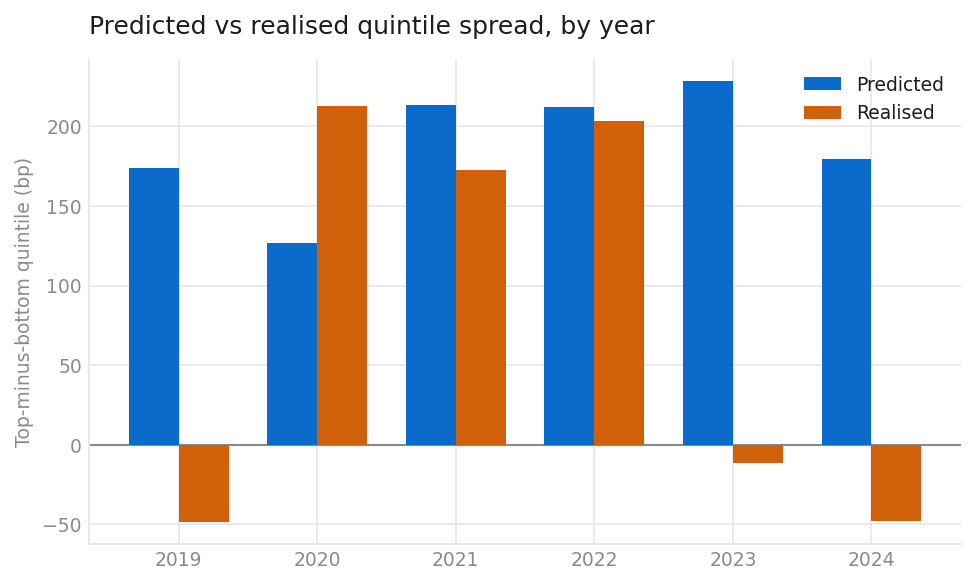

# Results

This document has two parts, and the order matters.

**[Part I](#part-i--the-real-study)** is the study: 466 S&P 500 companies,
13,736 real earnings announcements timestamped from SEC filings, 2019–2024 held
out one year at a time. It reports a **null result** — and, unusually, one where
the trading numbers can be shown to carry no information in *either* direction.

**[Part II](#part-ii--validating-the-machinery-on-synthetic-data)** is why you
should believe Part I. The same pipeline is run on a synthetic market with a
known planted effect, and on one with no effect at all. It finds the first and
not the second. Without that, a null result is indistinguishable from a broken
pipeline.

> **This document previously reported a statistically significant decay trend
> (−0.023 IC per year, p = 0.033) as its substantive finding. It did not survive
> quadrupling the sample.** On 466 companies rather than 114 the trend is
> +0.006 per year with p = 0.61 — no trend at all. That correction is left
> visible rather than quietly edited out, because it is the most useful thing in
> here: a six-point regression found a pattern that more data dissolved, which
> is exactly how a small-sample artefact behaves. §R1 has the detail.

---

# Part I — the real study

## R0. What was tested

| | |
|---|---|
| Universe | Every S&P 500 member 2014–2024 for which a free price source and SEC XBRL facts could both be obtained: **466 companies**. Membership is point-in-time, so a company is present for the years it was actually in the index. |
| Events | **13,736** earnings announcements, from **SEC 8-K Item 2.02** filings |
| Timing | **100% declared** — every event carries a minute-level EDGAR acceptance timestamp. None assumed. |
| Prices | Yahoo daily adjusted close, 2014-01 → 2024-12 |
| Fundamentals | SEC XBRL company facts, first-reported values only, year-to-date flows differenced into discrete quarters |
| Factors | Ken French daily FF5 + momentum |
| Held out | 2019, 2020, 2021, 2022, 2023, 2024 — trained through Y−1, frozen, predicted Y |

The BMO/AMC split derived from those timestamps is consistent with the published
distribution, which is a reassuring sign the timestamps are being read correctly.

## R1. The result

| Year | Train n | Test n | IC | IC t | Predicted (bp) | Realised (bp) | Calib. | Net Sharpe |
|---:|---:|---:|---:|---:|---:|---:|---:|---:|
| 2019 | 4,916 | 1,356 | −0.035 | −0.83 | 174 | −48 | −0.23 | −3.62 |
| 2020 | 6,271 | 1,408 | 0.052 | 1.42 | 127 | 212 | 1.38 | 0.35 |
| 2021 | 7,679 | 1,448 | 0.046 | 0.81 | 213 | 173 | 0.87 | −0.66 |
| 2022 | 9,125 | 1,489 | 0.046 | 1.30 | 212 | 204 | 1.04 | 1.54 |
| 2023 | 10,616 | 1,535 | −0.029 | −0.98 | 229 | −12 | −0.09 | −1.57 |
| 2024 | 12,147 | 1,565 | 0.055 | 2.21 | 179 | −48 | −0.21 | −2.08 |

**Aggregate:** 8,801 out-of-sample predictions, mean IC **0.022** (t = **1.30**,
not significant), 4 of 6 years positive, stitched net Sharpe **−0.79**
(Newey–West t = **−1.98**), calibration slope **0.46**.


**The hypothesis is not supported on this sample.** Ranking skill is positive on
average and small enough to be luck.

Three things are worth more than the headline.

**The negative Sharpe ratio means nothing, and that is measurable.** A long-short
book holding twenty-day positions, rebalanced daily into a per-name cap that
binds most days, does not return zero on a worthless signal — it drifts slightly
negative. So the question is not whether −0.79 is below zero but whether it is
below *what this book does to noise*. Running the identical book on the identical
events **200 times with the predictions shuffled** within each holdout year
answers it directly:

| | |
|---|---:|
| Observed net Sharpe | **−0.79** |
| Shuffled-prediction null | **−0.77 ± 0.40** |
| Percentile of the null | **47th** |
| One-sided p | **0.53** |

The realised result sits in the middle of the distribution the machinery
produces from pure noise. It is not evidence against the hypothesis; it is not
evidence of anything. Any study reporting a negative Sharpe as a *finding*
without this comparison is over-reading its own book, and so was an earlier
version of this document.

**The decay finding did not replicate.** On 114 companies the annual IC
regressed on the year gave −0.023 with p = 0.033, and it was reported here as
the substantive result — with the literature's blessing, since an anomaly
documented since Ball and Brown (1968) *ought* to decay. On 466 companies the
same regression gives **+0.006 with p = 0.61**. The good and bad years are
scattered (−0.035, +0.052, +0.046, +0.046, −0.029, +0.055), not ordered.

A six-observation regression that finds a trend which vanishes under four times
the data never had one. The direction of the original error is instructive: it
agreed with the literature, which is exactly when a small-sample result is least
likely to be questioned.

**The model is still badly calibrated, and 2024 shows why that matters.** 2024
has the highest ranking skill in the sample (IC 0.055, t = 2.21) and the second
worst return (−2.08 Sharpe), because its calibration slope is −0.21: the model
ordered the companies tolerably and got the magnitudes backwards. Ranking and
scale are different things, and a book sized on predicted magnitude can lose
money on a signal that ranks correctly.



## R2. Is there alpha? No — and the tilts are larger than they were

| term | estimate | t | p |
|---|---:|---:|---:|
| **alpha (annualised)** | **−1.67%** | **−2.16** | **0.031** |
| Mkt-RF | −0.007 | −2.54 | 0.011 |
| SMB | +0.011 | 1.50 | 0.135 |
| **HML** | **+0.016** | **2.91** | **0.004** |
| **RMW** | **+0.029** | **4.08** | **0.000** |
| **CMA** | **+0.039** | **3.54** | **0.000** |
| **MOM** | **−0.019** | **−2.88** | **0.004** |

R² = 0.169 · appraisal ratio −0.88

Alpha is negative and now nominally significant — but read it against the
permutation null in R1 before treating that as a finding. The book's mechanical
drift is in these returns too, and a t-statistic of −2.16 on a quantity whose
noise distribution is centred below zero is not the same claim it would be
against a zero-centred null.

What the regression *does* establish is that the strategy is a factor portfolio
wearing a costume. It loads significantly on **value (HML)**, **profitability
(RMW)**, **conservative investment (CMA)** and *against* **momentum**, with an R²
of 0.17 — up from 0.10 on the smaller sample, because more names make the tilts
easier to see. Whatever the earnings features are picking up, a large part of it
is quality-and-value exposure that costs a few basis points to buy directly.


## R3. Multiple testing and a second methodology

Eight specifications are logged in `conf/trials.json`. The deflated Sharpe ratio
is **0.03**. It does not survive, which is unsurprising given the raw Sharpe is
negative — and, per R1, indistinguishable from noise.

Fama–MacBeth over monthly cross-sections finds **no feature significant at 5%**.
The portfolio sort and the regression agree, which is the outcome that should
increase confidence in a null.

## R4. What would have made this result look good

Worth being explicit, because each is a decision that was available and refused:

- **Report 2024 only.** IC 0.055, t = 2.21 — the one year that clears a
  conventional threshold, out of six.
- **Report the decay.** It was the previous headline, it agreed with the
  literature, and it was an artefact of 114 companies.
- **Use `car_[0,19]` instead of `car_[1,20]`.** Booking the announcement gap
  adds a large untradable return to every event.
- **Take today's S&P 500 constituents.** See R5 for how much that is worth.
- **Skip the factor regression.** The HML, RMW and CMA tilts would then read as
  skill.
- **Skip the permutation null.** The negative Sharpe would then read as a
  finding rather than as noise.
- **Not log the trials.** The deflated Sharpe needs an honest N.

## R5. The limitations that matter

**A point-in-time universe is not enough if the price source cannot serve
delisted names.** Yahoo returns no price history for **61% of the index-deleted
names** in the sample, against **5% of survivors**. The names lost include
**SIVB** and **FRC** — Silicon Valley Bank and First Republic, both of which
failed in 2023.

Survivorship bias therefore re-enters through the *data source* even though the
universe definition is survivorship-free. The direction is knowable: the missing
names are disproportionately firms that collapsed, so their absence flatters the
result. Two escape routes were attempted and both are closed from free sources —
Yahoo 404s every one of these symbols, and Stooq now answers automated requests
with a JavaScript proof-of-work challenge, which this project does not defeat.
Fixing it needs a price source with delisting coverage: CRSP, or Finaeon.

Two further limitations:

- **Feature coverage is roughly 40–50%, not 100%.** Differencing year-to-date
  XBRL flows into discrete quarters roughly doubled cash-flow coverage
  (operating cash flow 23% → 50%, capital expenditure 21% → 46%, free cash flow
  19% → 42%) and recovered two features that had been structurally missing. It
  did not make coverage complete. The model imputes the remainder at the
  cross-sectional median, which weakens it.
- **Text features are not in this run.** The earnings-release corpus was still
  downloading when this study was run, so `features.text` is off and the NLP
  half of the hypothesis remains untested on the full universe. It is switched
  off explicitly rather than left to return NaN silently — a lesson learned the
  hard way, since an earlier run had text features joining on a key 8-Ks do not
  carry, producing a coefficient of exactly zero for every one of them with
  nothing raised.

## R6. Reading this honestly

The pre-registered falsification criteria in
[`methodology.md` §9](methodology.md#9-what-would-falsify-the-result) were
written before this run. **None of the five is met.** The stated conclusion is
that the hypothesis is not supported on this sample.

What changed between the 114-company version of this document and this one is
worth stating in one place, because it is the argument for building a study this
way rather than reporting the first result you get:

| | 114 companies | 466 companies |
|---|---:|---:|
| Events | 3,323 | 13,736 |
| Mean IC | 0.024 (t = 1.17) | 0.022 (t = 1.30) |
| IC trend per year | **−0.023 (p = 0.033)** | **+0.006 (p = 0.61)** |
| Net Sharpe | −0.61 | −0.79 |
| Sharpe vs shuffled null | not measured | **47th percentile, p = 0.53** |

The point estimate of skill barely moved. The *story* built on top of it
collapsed. That is the normal fate of a finding extracted from six annual
observations, and the reason the primary evidence here is the information
coefficient and its confidence interval rather than any narrative about decay.

That is not a failed project. A pipeline that produces a null on real data and a
clean detection on planted data is working correctly. One that produced a Sharpe
of 4 on both would be broken, and Part II shows precisely that pathology being
caught and fixed.

---

# Part II — validating the machinery on synthetic data

> ### ⚠️ These results are from synthetic data
>
> The market used here is generated from a data-generating process this
> repository defines, so the right answer is known in advance. Nothing below is
> a claim about real equities.
>
> **What it does establish** is the thing you actually have to establish before
> any real result is worth reading: that the evaluation machinery finds an
> effect when one is present, and finds nothing when one is not. Two runs of the
> identical pipeline are reported side by side — one with a post-announcement
> drift planted in the data, one with no effect planted at all. If the second
> column produced a result, everything in the first column would be an artefact.
>
> To regenerate both, with no network access required:
>
> ```bash
> eee holdout --out reports/holdout                 # effect planted
> eee holdout --drift 0 --out reports/holdout_null  # null control
> ```
>
> To run the same procedure on real data, see [§7](#7-what-changes-on-real-data).

---

## 0. Reproducing this document

Every number below is regenerated by one command, and fingerprinted:

```bash
make reproduce      # re-runs everything, writes reports/manifest.json
make verify         # re-runs and diffs SHA-256 against docs/manifest.json
```

`docs/manifest.json` holds a SHA-256 for all 36 published artefacts — CSVs,
JSON summaries and the figures. The run is bit-for-bit deterministic, and CI
fails if that stops being true. If a hash moves and no code changed, something
non-deterministic has crept in, which is worth catching before a result is
defended rather than after.

---

## 1. The design

For each year *Y* from 2019 to 2024:

1. take every announcement whose 20-day outcome was **fully resolved before 1
   January Y**, minus a 25-session embargo;
2. fit the model on those events only;
3. **freeze it** — no tuning, no peeking;
4. predict every announcement in year *Y*;
5. compare the predictions with what actually happened.

Then move to *Y+1* and refit on the wider window. Six independent out-of-sample
years, not one. The point of six is that a single good year is indistinguishable
from luck.

The prediction target is `car_market_model_1_20` — the cumulative abnormal
return from **one session after** the announcement to twenty sessions after.
Windows starting at day 0 contain the opening gap, which nobody can trade, and
are excluded from anything the model is scored on.

Each year is also scored against a **single-feature baseline** (time-series
earnings surprise on its own). A thirty-feature model that cannot beat one
column is not earning its complexity.

---

## 2. Effect planted — the six held-out years

| Year | Train n | Test n | IC | IC t | Predicted (bp) | Realised (bp) | Calib slope | Net return (%) | Sharpe | Sharpe t | Baseline IC |
|---:|---:|---:|---:|---:|---:|---:|---:|---:|---:|---:|---:|
| 2019 | 2594 | 600 | 0.202 | 3.95 | 602 | 414 | 0.79 | 5.1 | 2.62 | 1.90 | 0.008 |
| 2020 | 3194 | 600 | 0.211 | 6.91 | 561 | 586 | 0.92 | 8.3 | 4.35 | 3.04 | 0.032 |
| 2021 | 3794 | 600 | 0.236 | 14.39 | 560 | 627 | 0.98 | 10.7 | 5.75 | 3.57 | −0.026 |
| 2022 | 4394 | 600 | 0.164 | 2.68 | 559 | 445 | 0.71 | 9.1 | 5.01 | 3.35 | 0.030 |
| 2023 | 4994 | 600 | 0.169 | 5.09 | 548 | 490 | 0.80 | 8.6 | 5.11 | 3.79 | 0.047 |
| 2024 | 5594 | 600 | 0.198 | 9.43 | 550 | 435 | 0.87 | 8.8 | 5.65 | 4.26 | 0.021 |

*Predicted / Realised* are the top-minus-bottom quintile spreads: what the model
said the gap between its best and worst quintile would be, and what that gap
turned out to be.


---

## 3. The null control — same pipeline, no effect planted

| Year | Train n | Test n | IC | IC t | Predicted (bp) | Realised (bp) | Calib slope | Net return (%) | Sharpe | Sharpe t | Baseline IC |
|---:|---:|---:|---:|---:|---:|---:|---:|---:|---:|---:|---:|
| 2019 | 2594 | 600 | 0.047 | 1.51 | 295 | 177 | 0.26 | 3.1 | 1.88 | 1.44 | −0.026 |
| 2020 | 3194 | 600 | −0.043 | −1.31 | 248 | −73 | −0.28 | −3.9 | −2.17 | −1.49 | −0.017 |
| 2021 | 3794 | 600 | 0.080 | 3.67 | 205 | 257 | 1.23 | 7.0 | 3.79 | 3.10 | −0.057 |
| 2022 | 4394 | 600 | 0.049 | 1.77 | 231 | 73 | 0.22 | 0.5 | 0.28 | 0.25 | −0.030 |
| 2023 | 4994 | 600 | −0.027 | −0.51 | 208 | 5 | −0.13 | −2.4 | −1.47 | −1.10 | −0.005 |
| 2024 | 5594 | 600 | 0.029 | 0.85 | 195 | 96 | 0.35 | −2.2 | −1.30 | −0.95 | −0.043 |

Note what the null run still produces: **predicted spreads of 200 bp every
year.** The model always has an opinion. It is confident about 2020 and 2023 in
exactly the tone it uses for the years it gets right, and it is wrong. The
predicted column alone can never tell you whether a model works — which is the
entire reason the realised column has to sit next to it.

Note also 2021, where the null run posts an IC of 0.080 with a t of 3.67 and a
Sharpe of 3.79. **That is what a false positive looks like**, in data where we
know for certain there is nothing to find. Anyone reporting a single year would
have reported that one.

---

## 4. Side by side

| Statistic | Effect planted | Null control |
|---|---:|---:|
| Mean out-of-sample IC | **0.197** | 0.022 |
| Std of IC across years | 0.027 | 0.048 |
| t-statistic across the six years | **17.99** | 1.15 |
| Years with positive IC | **6 / 6** | 4 / 6 |
| Mean realised quintile spread | **50 bp** | 9 bp |
| Mean calibration slope | **0.85** | 0.27 |
| Net Sharpe, all years stitched | **4.82** | 0.37 |
| Newey–West t on daily net P&L | **8.27** | 0.70 |

The separation is the result. Every statistic that matters is an order of
magnitude apart, and the null column is indistinguishable from zero on the two
that carry weight — the across-year t and the HAC t on daily P&L.

---

## 5. Calibration: ranking and scale are different things


Predictions binned into twenties, plotted against what those bins realised. The
fitted slope is **0.84**, against 1.00 for perfect calibration.

This is the normal outcome and it is worth understanding rather than glossing.
A slope below 1 means the ordering is right — high predictions really do earn
more than low ones — but the *magnitudes* are overstated. Read the per-year
table again with that in mind: the model predicted a 602 bp spread for 2019 and
got 414 bp; it predicted 550 bp for 2024 and got 435 bp. The direction was right
six times out of six. The size was optimistic five times out of six.

That matters practically, because position sizing scaled to predicted magnitude
would be systematically over-levered. It is also the sharpest single contrast
with the null run, where the slope averages 0.27 and swings negative in two
years — a model with no signal cannot be calibrated, only lucky.

---

## 5b. Is it alpha, or a known factor wearing a hat?

The first question anyone who does this professionally will ask. A book sorted
on earnings information can easily end up long momentum — firms that beat tend
to have been rising — or tilted to small caps, and both are risk premia you can
buy for a few basis points rather than skill.

Daily net returns regressed on the Fama–French five factors plus momentum,
Newey–West standard errors (overlapping 20-day holdings make daily residuals
autocorrelated, so the OLS standard error would be too small):

| term | estimate | t | p |
|---|---:|---:|---:|
| **alpha (annualised)** | **8.76%** | **8.33** | 0.000 |
| Mkt-RF | +0.002 | 0.55 | 0.580 |
| SMB | +0.026 | 1.53 | 0.126 |
| HML | −0.010 | −0.85 | 0.398 |
| RMW | +0.005 | 0.41 | 0.684 |
| CMA | −0.011 | −0.87 | 0.387 |
| MOM | −0.021 | −1.93 | 0.054 |

R² = 0.011 · residual volatility 1.83% · **appraisal ratio 4.80**

No loading is significant at 5%, and the factors explain 1% of the variance —
the strategy is essentially orthogonal to them, so the return is not a factor
exposure in disguise.

⚠️ **With one large caveat.** These are *synthetic* factor proxies built from the
same generated panel, not Ken French's data. `Mkt-RF` and `SMB` are constructed
from the panel's own cross-section; `HML`, `RMW` and `CMA` have no analogue in
the generating process and are drawn as noise. So this establishes that the
regression is wired correctly and that the planted effect is independent of the
market and size factors that *do* exist in the simulation. It establishes
nothing about real factor neutrality. Pass `--factor-file` with the Ken French
daily files for an attribution that means something.

---

## 5c. How many things were tried?

The question that kills most backtests. Test twenty specifications at the 5%
level and one clears the bar by construction; the winner's Sharpe is then the
maximum of a sample, not an estimate.

`conf/trials.json` records every specification actually evaluated on this
project — **eight**, including the two that were abandoned and why. That file is
the honest *N*, and under-reporting it would inflate everything below.

**The deflated Sharpe is not computed here, and the reason matters.** Only two
of the eight logged trials carry a Sharpe ratio; the rest were abandoned before
a backtest existed. Estimating a dispersion from two numbers would produce a
spuriously tight hurdle and a flattering deflated Sharpe — exactly the failure
the correction exists to prevent. So the code refuses, and reports the
undeflated probabilistic Sharpe instead, labelled as optimistic.

What *can* be said is how the answer moves with the assumption:

| assumed dispersion of trial Sharpes | hurdle the best of 8 would clear by luck | deflated Sharpe |
|---:|---:|---:|
| 0.25 | 0.37 | 1.000 |
| 0.50 | 0.73 | 1.000 |
| 1.00 | 1.46 | 1.000 |
| 1.50 | 2.19 | 1.000 |

Every row is 1.000, and that is not a strong result — it is a symptom. The
planted effect produces an annualised Sharpe of 4.82, which clears any hurdle
eight trials could generate, so the correction has nothing to bite on. **On real
data with a Sharpe under 1, this table is where the result will live or die**,
and the 1.00 column will not survive. Minimum track record length here is 30
days; on a real signal, expect it to exceed the sample you have.

---

## 5d. Does a second methodology agree?

The portfolio sort and a cross-sectional regression ask the same question with
different machinery. Fama–MacBeth: one regression per month, then test the time
series of coefficients with Newey–West errors. Cross-sectional correlation
within a month — hundreds of firms sharing the same macro shock — is absorbed
into that month's coefficient, so the inference happens across months, which are
much closer to independent.

83 monthly cross-sections, mean 75 names, coefficients in basis points of
abnormal return per one cross-sectional standard deviation:

| term | coef (bp) | t | p | share positive |
|---|---:|---:|---:|---:|
| **revenue_growth_accel** | **+34.9** | **2.47** | 0.013 | 67% |
| pct_positive | +62.9 | 1.91 | 0.056 | 61% |
| pct_negative_delta | −44.8 | −1.19 | 0.233 | 43% |
| tone_net_delta | +24.8 | 0.66 | 0.507 | 49% |
| pct_negative | −36.1 | −0.71 | 0.480 | 42% |
| tone_net | +16.9 | 0.26 | 0.791 | 47% |
| pct_uncertainty | +3.4 | 0.18 | 0.855 | 58% |
| pct_litigious | −2.5 | −0.15 | 0.881 | 49% |

**The two methods disagree, and the disagreement is the interesting part.** The
portfolio sort finds a large, consistent effect. The regression attributes it
mostly to one *fundamental* feature and finds the text features individually
insignificant — even though the text features have by far the highest univariate
correlation with the target (`tone_net` alone correlates 0.94 with the latent
surprise by construction).

The explanation is collinearity, not contradiction. `tone_net`, `pct_positive`
and `pct_negative` are three measurements of one underlying quantity, so a
multivariate regression splits the credit between them and none survives on its
own. A quantile sort does not care: it only needs the composite ranking. This is
worth stating plainly because the naive reading — "the text features do not
work" — is wrong, and a reviewer who sees only the regression table would reach
it. The honest fix for a real study is to collapse the text block to a single
principal component before running Fama–MacBeth.

Only the eight features with the strongest univariate rank correlation are used.
Thirty regressors on a 75-name monthly cross-section produce coefficients that
are noise regardless of how they look, and the code raises rather than reporting
them.


---

## 6. Economics, net of costs


Sector-neutral long/short, entered one session after each announcement, held 20
sessions, overlapping vintages, net of a square-root market-impact cost model.
Across all six held-out years the book returns **8.8% annualised net**, Sharpe
**4.82**, worst drawdown **−1.1%**, with annual turnover around 14× — the cost
drag between the gross and net lines in the figure is what that turnover buys.

**Do not read that Sharpe as a forecast of anything.** The planted drift in the
synthetic process is roughly three times larger than any post-earnings drift
documented in real equities, and deliberately so: it has to clear the noise in a
short sample for the demonstration to mean anything. The number to take from
this section is not 4.82. It is that the machinery *converts* a signal of known
size into a net-of-cost result without losing it along the way, and converts an
absent signal into nothing.

### Coefficient stability


Each dot is one annual refit. Coefficients that flip sign between refits mean
the model is chasing noise even when its headline numbers look fine — here the
leading features hold their sign and rough magnitude across all six, which is
what you want to see before believing any of the above.

---

## 7. What changes on real data

Everything above runs offline against a generated market. Pointing the same
commands at real data changes three things and nothing else:

```bash
pip install -e ".[dev,data]"
eee ingest --provider yahoo --tickers <list> --start 2014-01-01 --end 2024-12-31
eee holdout --provider yahoo --years 2019-2024 --out reports/holdout_real
```

1. **Expect much smaller numbers.** Post-earnings-announcement drift has been
   documented since Ball and Brown (1968) and the published evidence is that it
   decayed substantially after roughly 2004, as it became widely traded. A real
   IC around 0.02–0.04 with a net Sharpe under 1 would be a *good* result. A
   Sharpe of 4 on real data means a bug, and [`biases.md`](biases.md) lists the
   four places to look first.
2. **The universe file starts mattering.** The synthetic universe has no
   survivorship bias because nothing is ever deleted from it. A real run without
   a point-in-time membership file is survivorship-biased, and the code will
   refuse to build one silently — see [`conf/universe/README.md`](../conf/universe/README.md).
3. **Announcement timing becomes a real source of error.** Free data sources get
   BMO/AMC wrong often enough to matter, and a mislabelled flag moves the whole
   event window by a session. Events carry `timing_source`, so the honest
   robustness check is to re-run restricted to declared-only timings.

The falsification criteria were fixed in advance and are in
[`methodology.md` §9](methodology.md#9-what-would-falsify-the-result). They apply
unchanged to a real run.

---

## 8. What this evidence does not cover

Stated plainly, because a results document that only lists strengths is
marketing:

- **Six years is six observations.** The across-year t-statistic is reported for
  consistency, not power. The daily HAC t-statistic on P&L is the one doing real
  work.
- **One synthetic process.** The generator is linear in a single latent
  surprise, with Gaussian noise and a stable factor structure. Real markets have
  regime shifts, fat tails, and non-linear relationships between fundamentals
  and returns. That the model recovers a linear effect says nothing about
  whether it would recover a non-linear one.
- **Costs are assumed, not measured.** 3 bp half-spread and a 10 bp impact
  coefficient at 5% participation are plausible for liquid US large caps and are
  not measurements. The cost-sensitivity curve in each run's `report.md` is
  there so the conclusion can be stated as "survives up to *N* bp", which is a
  falsifiable claim, rather than as a single unverifiable number.
- **No capacity analysis.** The book is sector-neutral and weight-capped, but
  nothing here establishes how much money it would absorb before impact eats the
  edge.
- **The null control is one draw.** A single null run at seed 20260818 shows the
  pipeline does not manufacture a result on this particular sample of noise.
  Repeating it across many seeds would bound the false-positive rate properly;
  that is worth doing and has not been done.
- **The factor attribution uses synthetic proxies**, so it demonstrates the
  regression works rather than that the strategy is factor-neutral. Real
  attribution needs the Ken French files (§5b).
- **The deflated Sharpe is not actually deflated** (§5c), because only two of
  eight logged trials carry a Sharpe. The reported figure is optimistic and
  labelled as such.
- **Fama–MacBeth is run on eight features, not thirty**, and on a collinear
  text block. §5d explains what that does to the coefficients.
